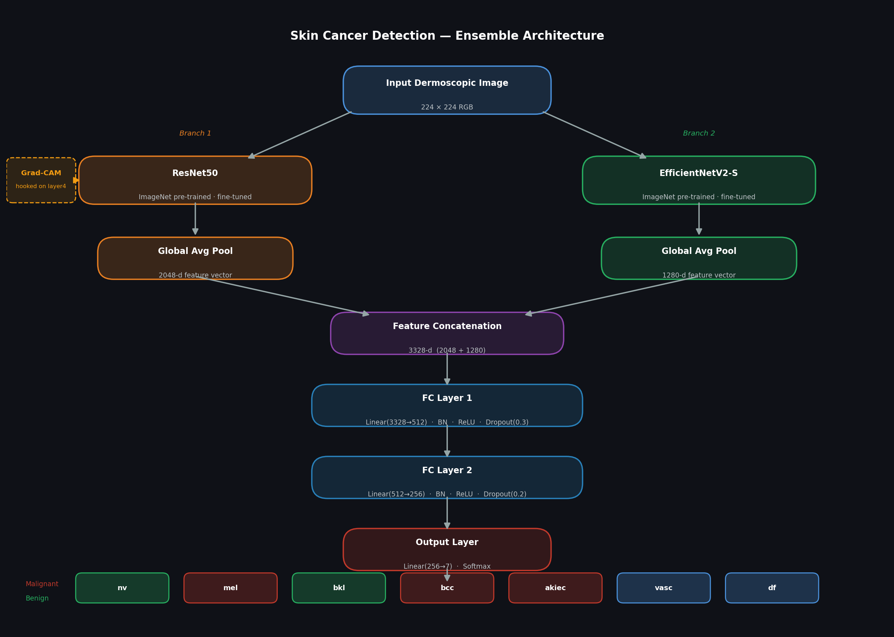

# Skin Cancer Detection — Ensemble Deep Learning Model


> **Live Demo:** [rajasri77/skin-cancer-detector on HF Spaces](https://huggingface.co/spaces/rajasri77/skin-cancer-detector)  
> **Model Weights:** [rajasri77/skin-cancer-model on HF Hub](https://huggingface.co/rajasri77/skin-cancer-model) (556 MB)

A skin lesion classification system built on the HAM10000 dermatoscopy dataset. The model fuses **ResNet50** and **EfficientNetV2-S** backbones into a hybrid ensemble that classifies 7 types of skin lesions from dermoscopic images, with full interpretability via Grad-CAM.

---

## Project Status

| Component | Status |
|-----------|--------|
| Exploratory Data Analysis | Complete |
| Data Pipeline & Augmentation | Complete |
| Hybrid Ensemble Architecture | Complete |
| Training Loop with Checkpointing | Complete |
| Evaluation (Accuracy, F1, Confusion Matrix) | Complete |
| Single-Image Inference | Complete |
| Grad-CAM Interpretability | Complete |
| Model Weights | Hosted on HF Hub |
| Gradio App | Live on HF Spaces |

---

## Model Performance

| Metric | Value |
|--------|-------|
| Best Validation Accuracy | **88.67%** (Epoch 18) |
| Best Validation Loss | **0.398** (Epoch 16) |
| Final Training Loss | **0.055** (Epoch 20) |
| Epochs Trained | 20 |

### Training Curve

| Epoch | Train Loss | Val Loss | Val Accuracy |
|-------|-----------|----------|-------------|
| 1 | 1.237 | 0.951 | 57.6% |
| 5 | 0.453 | 0.544 | 76.8% |
| 10 | 0.175 | 0.446 | 83.5% |
| 15 | 0.080 | 0.448 | 87.1% |
| 18 | 0.063 | 0.412 | **88.7%** |
| 20 | 0.055 | 0.412 | 88.5% |

---

## Architecture

The model is a **dual-branch fusion ensemble** — two CNNs fine-tuned on HAM10000 run independently, their deep feature vectors are concatenated, then passed through a shared MLP classifier.



```
Input Image (224x224 RGB)
        │
   ┌────┴────┐
   │         │
ResNet50   EfficientNetV2-S
(2048-d)    (1280-d)
   │         │
   └────┬────┘
        │  concat (3328-d)
  Linear(3328 → 512) + BN + ReLU + Dropout(0.3)
  Linear(512 → 256)  + BN + ReLU + Dropout(0.2)
  Linear(256 → 7)
        │
  Softmax → Class Probabilities
```

**Why this design?**
- ResNet50 excels at texture and macro-structure features
- EfficientNetV2-S captures fine-grained boundary details with better parameter efficiency
- Late fusion preserves each branch's inductive bias while learning a shared decision boundary

---

## Dataset — HAM10000

| Property | Detail |
|----------|--------|
| Total images | 10,015 dermoscopic images |
| Resolution | 600×450 px RGB JPG |
| Classes | 7 skin lesion types |
| Source | ISIC Archive / Kaggle |

### Class Distribution

| Code | Full Name | Type | Count |
|------|-----------|------|------:|
| `nv` | Melanocytic nevi | Benign | 6,705 |
| `mel` | Melanoma | **Malignant** | 1,113 |
| `bkl` | Benign keratosis-like lesions | Benign | 1,099 |
| `bcc` | Basal cell carcinoma | **Malignant** | 514 |
| `akiec` | Actinic keratoses / Bowen's disease | **Malignant** | 327 |
| `vasc` | Vascular lesions | Benign | 142 |
| `df` | Dermatofibroma | Benign | 115 |

The dataset is severely imbalanced. The pipeline handles this with **computed per-class weights** fed into the loss function.

---

## Key Features

- **Dual-backbone ensemble** — ResNet50 + EfficientNetV2-S
- **Imbalance handling** — sklearn `compute_class_weight` with balanced strategy
- **Advanced augmentation** — random crops, flips, rotation, affine transforms, colour jitter, ImageNet normalisation
- **CosineAnnealingLR** scheduler over 20 epochs
- **AdamW optimiser** for stable convergence
- **Model checkpointing** — saves `best_model.pth` on validation loss improvement
- **Comprehensive evaluation** — per-class precision/recall/F1, overall accuracy, confusion matrix heatmap
- **Grad-CAM** — hooked on ResNet50's `layer4` (7×7 spatial resolution) for accurate heatmaps

---

## Installation

```bash
# 1. Clone the repo
git clone https://github.com/Rajasrikondaveeti/skin-cancer-detection.git
cd skin-cancer-detection

# 2. (Recommended) create a virtual environment
python -m venv venv
venv\Scripts\activate          # Windows
# source venv/bin/activate     # macOS/Linux

# 3. Install CPU-only PyTorch (Windows default)
pip install torch torchvision torchaudio --index-url https://download.pytorch.org/whl/cpu

# 4. Install remaining dependencies
pip install -r requirements.txt
```

For GPU training (CUDA 12.x):
```bash
pip install torch torchvision torchaudio --index-url https://download.pytorch.org/whl/cu121
```

---

## Dataset Setup

Download the [HAM10000 dataset from Kaggle](https://www.kaggle.com/datasets/kmader/skin-cancer-mnist-ham10000) and place it so the directory structure looks like:

```
skin-cancer-detection/
├── skin-cancer-mnist-ham10000/
│   ├── HAM10000_metadata.csv
│   ├── HAM10000_images_part_1/   ← 5,000 images
│   └── HAM10000_images_part_2/   ← 5,015 images
├── Ensemble_Analysis_Master.ipynb
├── Skin_Cancer_EDA.ipynb
└── requirements.txt
```

---

## Usage

### 1. Exploratory Data Analysis
Open `Skin_Cancer_EDA.ipynb` in Jupyter and run all cells. This generates:
- Class distribution and patient demographics charts
- Per-class sample visualisations
- Colour-channel analysis
- Pre-processed CSV files at multiple resolutions (8×8, 28×28)

### 2. Train the Ensemble Model
Open `Ensemble_Analysis_Master.ipynb` and run all cells sequentially.

**Estimated training time:**
- CPU: ~8–12 hours (20 epochs, batch size 32)
- GPU (RTX 3060+): ~30–45 minutes

Training saves:
- `best_model.pth` — checkpoint with best validation accuracy
- `history.json` — loss and accuracy per epoch

### 3. Evaluate
The evaluation section of the notebook loads `best_model.pth` and outputs:
- Full classification report (per-class precision, recall, F1)
- Overall accuracy and top-3 accuracy
- `confusion_matrix.png` — heatmap saved to disk

### 4. Predict on a Single Image
```python
predict("skin-cancer-mnist-ham10000/HAM10000_images_part_1/ISIC_0024306.jpg")
```
Returns predicted class, confidence score, full class description, and top-3 probabilities.

### 5. Run the App Locally
```bash
cd hf_space
pip install -r requirements.txt
python app.py
```
Then open `http://localhost:7860` in your browser.

---

## Training Configuration

| Hyperparameter | Value |
|----------------|-------|
| Input size | 224×224 |
| Batch size | 32 |
| Epochs | 20 |
| Optimiser | AdamW |
| Learning rate | 1e-4 |
| LR schedule | CosineAnnealingLR |
| Loss | CrossEntropyLoss + class weights |
| Train/Val split | 80/20 stratified |
| Dropout | 0.3 (fc1), 0.2 (fc2) |

---

## Project Structure

```
skin-cancer-detection/
├── Ensemble_Analysis_Master.ipynb   # Main ML pipeline (train → eval → predict → interpret)
├── Skin_Cancer_EDA.ipynb            # Exploratory data analysis & preprocessing
├── requirements.txt                 # Python dependencies for local training
├── history.json                     # Training curves (loss & accuracy per epoch)
├── hf_space/
│   ├── app.py                       # Gradio web app with Grad-CAM
│   ├── requirements.txt             # HF Spaces dependencies
│   └── README.md                    # HF Spaces model card
├── skin-cancer-mnist-ham10000/      # Dataset directory (not tracked in git)
│   ├── HAM10000_metadata.csv
│   ├── HAM10000_images_part_1/
│   └── HAM10000_images_part_2/
└── .gitignore
```

---

## Dependencies

| Package | Version |
|---------|---------|
| torch | 2.11.0 |
| torchvision | 0.26.0 |
| timm | ≥1.0.0 |
| numpy | 1.26.4 |
| pandas | ≥2.0.0 |
| scikit-learn | ≥1.3.0 |
| pillow | 10.2.0 |
| matplotlib | ≥3.7.0 |
| seaborn | ≥0.12.0 |
| tqdm | ≥4.65.0 |

---

## Potential Improvements

- **Test-time augmentation (TTA)** — average predictions over multiple augmented views
- **Mixup / CutMix** — stronger regularisation for the minority classes
- **Vision Transformer branch** — add a ViT-B/16 as a third ensemble member
- **ISIC 2019/2020 data** — extend training to 25,000+ images for better generalisation
- **ONNX export** — for deployment to edge devices or web APIs

---

> **Disclaimer:** This tool is for educational and research purposes only. It is not a substitute for professional medical diagnosis. Always consult a qualified dermatologist.
